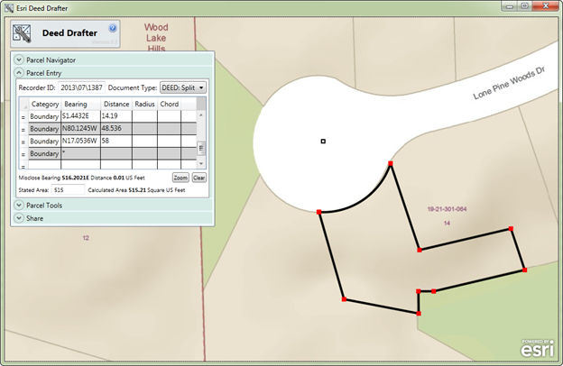

deed-drafter
============

***This deed drafter repo has been moved to mature support, applications built from this repo are in mature support. Check out the replacement app below***

***Parcel Drafter is a configuration of the Web AppBuilder (Developer Edition) with a custom widget. If you would like to customize the Parcel Widget then download the Web AppBuilder (Developer Edition) and grab the custom widget from the [Parcel Drafter](https://github.com/Esri/parcel-drafter) repo***

Deed Drafter is an ArcGIS Runtime application that helps mapping technicians enter metes-and-bounds descriptions from deeds and other property descriptions and check for closure errors.

## Features

* Navigate- Search and identify parcels
* Parcel entry - Enter parcel description
* Parcel tools - Scale and rotate entered parcel on map
* Share - Save to email parcel description via Cadastral XML format

## Instructions

### Esri Sample Services

Esri's sample services can be used with this repository to extend the application.

### Your Services

[Detailed help](http://solutions.arcgis.com/local-government/help/deed-drafter/)
on the ArcGIS Solution Site can guide you in the setup and configuration of the app with your services.

### General Help
[New to Github? Get started here.](http://htmlpreview.github.com/?https://github.com/Esri/esri.github.com/blob/master/help/esri-getting-to-know-github.html)

## Requirements

### Esri Sample Services

* Microsoft .NET Framework 4.5 available from the [Microsoft website](http://www.microsoft.com/en-us/download/details.aspx?id=30653)

### Your Services

* ArcGIS for Desktop 10.2 - Standard or Advanced - [About](http://www.esri.com/software/arcgis/arcgis-for-desktop)
* ArcGIS for Server 10.2 - Standard or Advanced - [About](http://www.esri.com/software/arcgis/arcgisserver)
* Local Government Information Model - [About](http://solutions.arcgis.com/local-government/help/local-government-information-model/)

## Resources

Learn more about Esri's [ArcGIS for Local Government maps and apps](http://solutions.arcgis.com/local-government/).

Show me a list of other [Local Government GitHub repositories](http://esri.github.io/#Local-Government).

This application uses the 1.0 version of
[Esri's ArcGIS Runtime](http://www.esri.com/software/arcgis/runtime/features/);
see the site for resources on getting started with ArcGIS Runtime.

## Contributing

Esri welcomes contributions from anyone and everyone. 
Please see our [guidelines for contributing](https://github.com/esri/contributing).

## Licensing

Copyright 2013 Esri

Licensed under the Apache License, Version 2.0 (the "License");
you may not use this file except in compliance with the License.
You may obtain a copy of the License at

   http://www.apache.org/licenses/LICENSE-2.0

Unless required by applicable law or agreed to in writing, software
distributed under the License is distributed on an "AS IS" BASIS,
WITHOUT WARRANTIES OR CONDITIONS OF ANY KIND, either express or implied.
See the License for the specific language governing permissions and
limitations under the License.

A copy of the license is available in the repository's
[LICENSE.txt](LICENSE.txt) file.

